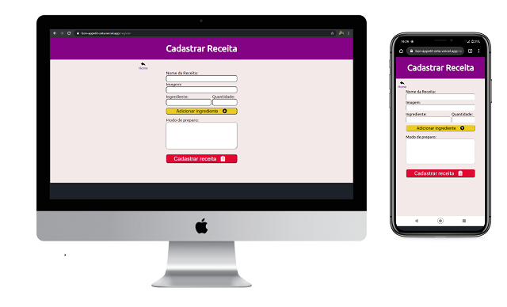
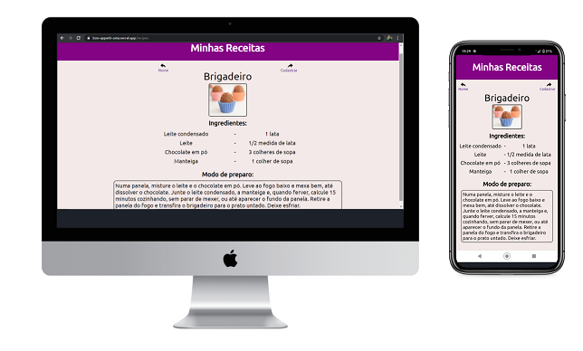

# Bon Appetit
In this page the user can register all your recipes of dessert and search for only one ingredient.

## Table of Contents
- [Bon Appetit](#bon-appetit)
  - [Table of Contents](#table-of-contents)
  - [Screenshots (mobile and desktop layout)](#screenshots-mobile-and-desktop-layout)
  - [Getting Started](#getting-started)
  - [How it works](#how-it-works)
  - [Clone](#clone)
  - [Deploy](#deploy)
  - [Contributing](#contributing)
  - [License](#license)

## Screenshots (mobile and desktop layout)

## Getting Started
This page was created using HTML5, CSS3 and Javascript with ReactJS for the front-end, and NodeJS for the back end. Beyond that, was used jason-server for create a repository for the recipes, therefore for visualizing this page access:

[Bon Appetit](https://bon-appetit-zeta.vercel.app/)

## How it works
The user can register a recipe click on the Cadastrar Receita button. In this page, the user have to fill all inputs with the informations about a recipe like name, image, ingredients and how to prepare then.
So, the user can search a recipe put an ingredient in the input of home page and click in the Pesquisar Receita button. Wheter exist some recipe with the ingredient informed, this recipe will be show in the next page.

## Clone
Clone this repository to your local machine using https://github.com/GCMoura/bon-appetit.git.

## Deploy
The back end of this application was deployed using 
[Heroku](https://heroku.com) and the front end was deployed using [Vercel](https://vercel.com/).

## Contributing
If you would like to contribute, please fork the repository and use a feature branch. Pull requests are warmly welcome.

## License
This project is licensed under the MIT License - see the [LICENSE.md](LICENSE.md) file for details.

---
Made with :heart: by Gabriel Moura. [Get in touch!](https://www.linkedin.com/in/gabriel-moura-b45b90150/)